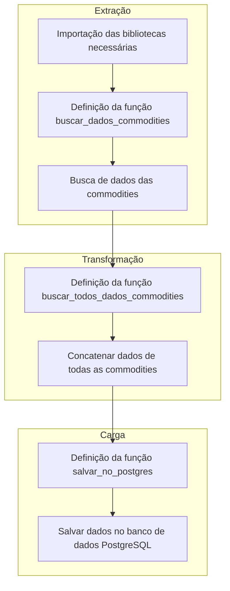

# Projeto DW do Zero

### Explicação do Workflow ETL

1. **Extração**:
    - **Importação das bibliotecas necessárias**: Importamos as bibliotecas `yfinance`, `pandas` e `sqlalchemy`.
    - **Definição da função buscar_dados_commodities**: Definimos uma função para buscar os dados de um símbolo específico de commodities.
    - **Busca de dados das commodities**: Utilizamos a função `buscar_dados_commodities` para obter os dados de cada commodity.

2. **Transformação**:
    - **Definição da função buscar_todos_dados_commodities**: Definimos uma função para buscar os dados de todos os símbolos de commodities e concatená-los em um único DataFrame.
    - **Concatenar dados de todas as commodities**: Utilizamos a função `buscar_todos_dados_commodities` para concatenar todos os dados em um único DataFrame.

3. **Carga**:
    - **Definição da função salvar_no_postgres**: Definimos uma função para salvar o DataFrame resultante no banco de dados PostgreSQL.
    - **Salvar dados no banco de dados PostgreSQL**: Utilizamos a função `salvar_no_postgres` para salvar o DataFrame final no banco de dados PostgreSQL.

Este diagrama segue o estilo ETL, destacando claramente as etapas de Extração, Transformação e Carga.

