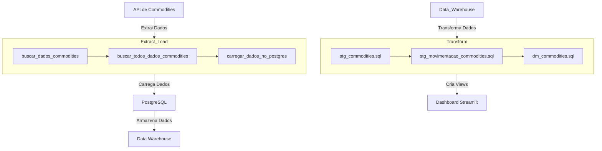

# Projeto de Data Warehouse de Commodities

  

### Descrição do Projeto

---

Você sabe quanto sua empresa vendeu ontem? Se precisar de mais de 3 segundos para responder, o workshop de hoje é ideal para você!

Nosso objetivo é desenvolver um Data Warehouse (DW) que armazene e analise dados de commodities, empregando uma arquitetura moderna de ETL (Extract, Transform, Load). Este projeto abrange várias etapas essenciais:

1. **Documentação do DBT**:
   - Criação de uma documentação completa e detalhada para facilitar o entendimento e a manutenção do processo de ETL, garantindo a transparência e a rastreabilidade dos dados.

2. **Dashboard Interativo**:
   - Desenvolvimento de um painel interativo usando Streamlit, que permite a visualização dinâmica dos dados de commodities, facilitando a tomada de decisões baseada em dados precisos e atualizados.

3. **Parte de Extract_Load**:
   - Implementação de um processo de extração de dados diretamente de uma API. Esses dados são então carregados diretamente em um banco de dados PostgreSQL, garantindo que a informação seja centralizada e facilmente acessível para análise.

4. **Parte de Seed**:
   - Utilização de seeds do DBT para carregar dados históricos e transacionais de commodities a partir de arquivos CSV. Esse processo garante que todos os dados relevantes sejam incluídos e estruturados corretamente no Data Warehouse.

5. **Models**:
   - Definição das transformações de dados utilizando o DBT. Isso inclui a criação de tabelas de staging, que servem como intermediárias, e de datamarts, que são específicas para análises detalhadas e relatórios. Estas transformações garantem que os dados estejam limpos, consolidados e prontos para análise.

6. **Implementação do Dashboard em Streamlit**:
   - Desenvolvimento de um dashboard com Streamlit que apresenta os dados de commodities de forma clara e interativa. Este dashboard permite aos usuários visualizar tendências, realizar comparações e obter insights valiosos para o negócio.

Este projeto é fundamental para qualquer empresa que precise de uma análise precisa e rápida de seus dados de vendas e movimentações de commodities, promovendo uma cultura de decisões orientadas por dados. 

---

Com essa abordagem, sua empresa poderá responder perguntas críticas sobre vendas e movimentações de commodities de forma rápida e eficaz, aumentando a eficiência operacional e a competitividade no mercado.

### Explicação do Workflow ETL

1. **Extração**:
    - **Importação das bibliotecas necessárias**: Importamos as bibliotecas `yfinance`, `pandas` e `sqlalchemy`.
    - **Definição da função buscar_dados_commodities**: Definimos uma função para buscar os dados de um símbolo específico de commodities.
    - **Busca de dados das commodities**: Utilizamos a função `buscar_dados_commodities` para obter os dados de cada commodity.

2. **Transformação**:
    - **Definição da função buscar_todos_dados_commodities**: Definimos uma função para buscar os dados de todos os símbolos de commodities e concatená-los em um único DataFrame.
    - **Concatenar dados de todas as commodities**: Utilizamos a função `buscar_todos_dados_commodities` para concatenar todos os dados em um único DataFrame.

3. **Carga**:
    - **Definição da função salvar_no_postgres**: Definimos uma função para salvar o DataFrame resultante no banco de dados PostgreSQL.
    - **Salvar dados no banco de dados PostgreSQL**: Utilizamos a função `salvar_no_postgres` para salvar o DataFrame final no banco de dados PostgreSQL.

Este diagrama segue o estilo ETL, destacando claramente as etapas de Extração, Transformação e Carga.

