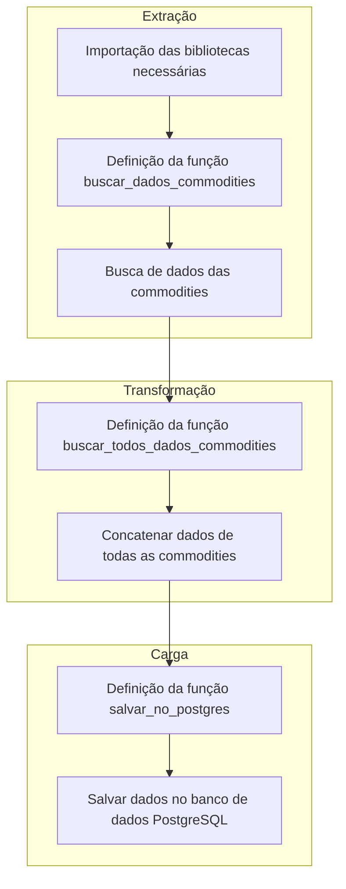

# Projeto DW do Zero

```mermaid
graph TD;
    subgraph Extração
        A[Importação das bibliotecas necessárias] --> B[Definição da função buscar_dados_commodities]
        B --> E[Busca de dados das commodities]
    end

    subgraph Transformação
        E --> C[Definição da função buscar_todos_dados_commodities]
        C --> F[Concatenar dados de todas as commodities]
    end

    subgraph Carga
        F --> D[Definição da função salvar_no_postgres]
        D --> G[Salvar dados no banco de dados PostgreSQL]
    end

```