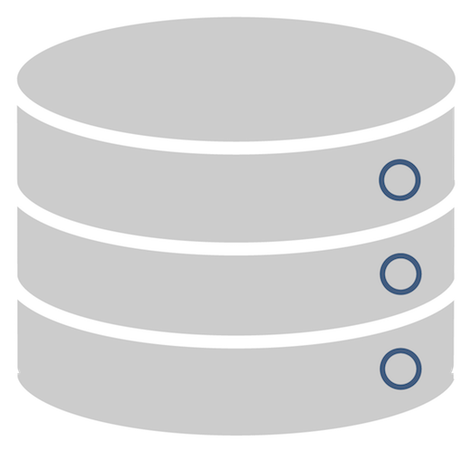
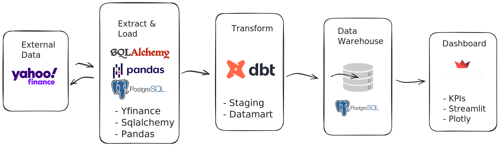
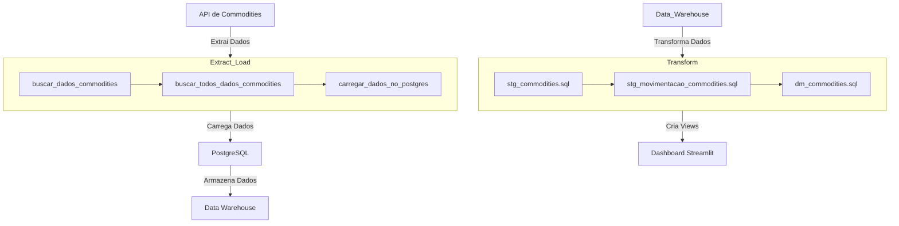

<p align="center">
  
</p>

<p align="center">
   &
  
</p>

<h3>Sumário</h3>


<p id="roadmap"> 
  <ul>
    <li> <a href="#techs">Tecnologias</a></li>
    <li> <a href="#id1">  Descrição do Projeto</a> </li>
    <li> <a href="#id2">  Explicação do Workflow ETL</a> </li>
    <li> <a href="#id3">  Como executar o Projeto</a> </li>
  </ul>
</p>


<h3  id="techs">Tecnologias</h3>

<p align=center>        
  </ul>
  <br>
</p>


# Projeto de Data Warehouse de Commodities


<p align="center">
  
</p>


<h3  id="id1">Descrição do Projeto</h3>

---

Você sabe quanto sua empresa vendeu ontem? Se precisar de mais de 3 segundos para responder, o workshop de hoje é ideal para você!

Nosso objetivo é desenvolver um Data Warehouse (DW) que armazene e analise dados de commodities, empregando uma arquitetura moderna de ETL (Extract, Transform, Load). Este projeto abrange várias etapas essenciais:

1. **Documentação do DBT**:
   - Criação de uma documentação completa e detalhada para facilitar o entendimento e a manutenção do processo de ETL, garantindo a transparência e a rastreabilidade dos dados.

2. **Dashboard Interativo**:
   - Desenvolvimento de um painel interativo usando Streamlit, que permite a visualização dinâmica dos dados de commodities, facilitando a tomada de decisões baseada em dados precisos e atualizados.

3. **Parte de Extract_Load**:
   - Implementação de um processo de extração de dados diretamente de uma API. Esses dados são então carregados diretamente em um banco de dados PostgreSQL, garantindo que a informação seja centralizada e facilmente acessível para análise.

4. **Parte de Seed**:
   - Utilização de seeds do DBT para carregar dados históricos e transacionais de commodities a partir de arquivos CSV. Esse processo garante que todos os dados relevantes sejam incluídos e estruturados corretamente no Data Warehouse.

5. **Models**:
   - Definição das transformações de dados utilizando o DBT. Isso inclui a criação de tabelas de staging, que servem como intermediárias, e de datamarts, que são específicas para análises detalhadas e relatórios. Estas transformações garantem que os dados estejam limpos, consolidados e prontos para análise.

6. **Implementação do Dashboard em Streamlit**:
   - Desenvolvimento de um dashboard com Streamlit que apresenta os dados de commodities de forma clara e interativa. Este dashboard permite aos usuários visualizar tendências, realizar comparações e obter insights valiosos para o negócio.

Este projeto é fundamental para qualquer empresa que precise de uma análise precisa e rápida de seus dados de vendas e movimentações de commodities, promovendo uma cultura de decisões orientadas por dados. 

---

Com essa abordagem, sua empresa poderá responder perguntas críticas sobre vendas e movimentações de commodities de forma rápida e eficaz, aumentando a eficiência operacional e a competitividade no mercado.


<h3  id="id2">Explicação do Workflow ETL</h3>


1. **Extração**:
    - **Importação das bibliotecas necessárias**: Importamos as bibliotecas `yfinance`, `pandas` e `sqlalchemy`.
    - **Definição da função buscar_dados_commodities**: Definimos uma função para buscar os dados de um símbolo específico de commodities.
    - **Busca de dados das commodities**: Utilizamos a função `buscar_dados_commodities` para obter os dados de cada commodity.

2. **Transformação**:
    - **Definição da função buscar_todos_dados_commodities**: Definimos uma função para buscar os dados de todos os símbolos de commodities e concatená-los em um único DataFrame.
    - **Concatenar dados de todas as commodities**: Utilizamos a função `buscar_todos_dados_commodities` para concatenar todos os dados em um único DataFrame.

3. **Carga**:
    - **Definição da função salvar_no_postgres**: Definimos uma função para salvar o DataFrame resultante no banco de dados PostgreSQL.
    - **Salvar dados no banco de dados PostgreSQL**: Utilizamos a função `salvar_no_postgres` para salvar o DataFrame final no banco de dados PostgreSQL.

Este diagrama segue o estilo ETL, destacando claramente as etapas de Extração, Transformação e Carga.




---

<h3  id="id3">Como executar o Projeto</h3>


Para usar o projeto você deve criar um ambiente virtual do Python, para isso você deve ter instalado em seu computador o [pyenv](https://github.com/pyenv/pyenv), [virtualenv](https://virtualenv.pypa.io/en/latest/installation.html) ou [poetry](https://python-poetry.org/docs/).

Obs: Copie apenas o texto, sem o simbolo `❯`.

```bash
# Ativando a virtual env
❯ poetry shell

# instalando as dependências
❯ poetry install
```


```bash
❯ python -m venv .venv

# Ativando o ambiente no Windows
❯ source .venv/bin/activate

# Ativando o ambiente no Linux e Mac
❯ source .venv/bin/activate

❯ pip install -r requirements.txt
```

Agora é necessário usar um banco de dados Postgres, uma boa forma de iniciar seus trabalhos com banco de dados é usando o [Render](https://docs.render.com/databases), com ele você cria um banco de dados postgres em alguns clicque, para criar o seu banco de dados usando essa plataforma assista a esse [Tutorial](https://www.youtube.com/watch?v=icpPqD0tjLg)


Após criar o banco de dados postgres você deve criar um arquivo `.env` que conterar o seguintes campos:


```bash
DB_HOST_PROD=dpg-cpke84q0si5c73cp9uog-a.virginia-postgres.render.com
DB_PORT_PROD=5432
DB_NAME_PROD=nome_banco_de_dados_criado
DB_USER_PROD=nome_do_usuario_do_banco_de_dados_criado
DB_PASS_PROD=senha_do_banco_de_dados
DB_SCHEMA_PROD=public
DB_THREADS_PROD=1
DB_TYPE_PROD=postgres
DBT_PROFILES_DIR=../
```

mude apenas os campos, `DB_NAME_PROD`, `DB_USER_PROD`, `DB_PASS_PROD`.

# Executando o projeto

Após os procedimentos acima terem sido feitos, o proximo passo é executar o projeto, para isso inicia-se executando o `Extract` e `Load` que que foi desenvolvido no código `extract_load.py` que está dentro da pasta `src`, para executa-lo, basta roda o seguinte comando no terminal.

```bash
❯ python src/extract_load.py
```

Com isso, o banco de dados postgres deve está com as seguintes tabelas criadas:

|Tables| campos|
|---|---|
|commodities|date, symbol, action, quantity|
|movimentacao_commodities|Date, Close, simbolo|


Caso não tenha ocorrido nenhum erro anteriormente, agora deve-se executar o comando que vai realizar o `transform`, para isso vamos usar o `dbt` para rodar as transformações contidas nos arquivos `sql` do projeto:

Antes de realizar o transformação, você pode verificar se o `dbt` consegue se comunicar com o banco de dados postgres, para isso entre para dentro da pasta `datawarehouse` pelo terminal e rodo o seguinte comando:


```bash
❯ dbt debug
```

caso tenha a seguinte mensagem no terminal, seguinifica que o `dbt` está se conectando ao banco de dados postgres:


```bash
.
.
.
23:25:46    retries: 1
23:25:46  Registered adapter: postgres=1.8.1
23:25:47    Connection test: [OK connection ok]

23:25:47  All checks passed!
```

Com isso é possivel realizar a transformação dos dados, basta executar o seguinte comando dentro da pasta `datawarehouse` pelo termianl:


```bash
 ❯ dbt run
```

Ao acessar o banco de dados, em `views` deve ter os seguintes views, `dm_commodities`, `stg_commodities`, `stg_movimentacao_commodities`.


|Views| campos|
|---|---|
|dm_commodities|data,simbolo,valor_fechamento, acao, quantidade,valor, ganho|
|stg_commodities|data, valor_fechamento, simbolo|
|stg_movimentacao_commodities|data, simbolo, acao, quantidade|


## Em desenvolvimento ...